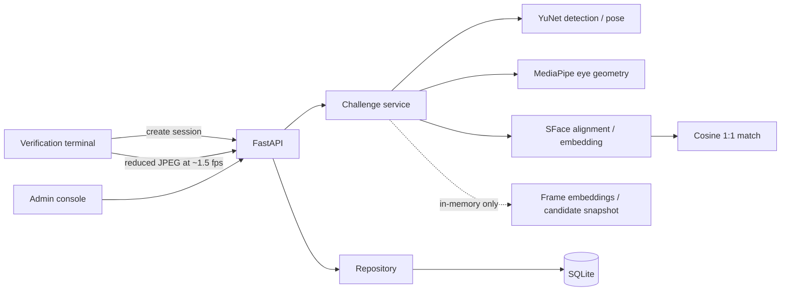

# BioGate V2

Local biometric identity verification platform with a camera-focused verification terminal and a separate administrative console. BioGate performs voluntary 1:1 face verification on a Windows CPU without cloud APIs, GPU, Docker, or an external database.

> **Active liveness is a demonstration mechanism and is not certified Presentation Attack Detection (PAD).** BioGate is a portfolio/demo system, not production authentication software.

## Screenshots

- `Terminal`: automatic face tracking and liveness challenge — run `/` locally.
- `Admin dashboard`: users, attempts, audit and privacy settings — run `/admin` locally.

Screenshots are placeholders by design: image files are ignored so face captures cannot accidentally enter Git.

## What V2 includes

- Russian default UI with centralized RU/EN localization and an in-app switch.
- Public verification terminal containing no administrative data.
- Automatic capture: no manual “capture frame” button.
- Live face bounding box, quality feedback, challenge step and progress overlay.
- Backend-owned, expiring, randomized `CENTER / TURN_LEFT / TURN_RIGHT / BLINK` challenges.
- YuNet face detection and five-point pose proxy; SFace alignment, embeddings and matching.
- MediaPipe Face Landmarker eye geometry for open → closed → open blink validation.
- Dedicated admin dashboard, user management, blocked accounts and user detail pages.
- Local Argon2id administrator login, expiring server-side sessions, CSRF protection and login throttling.
- Enrollment using 3–5 uploaded JPG/JPEG/PNG/WebP files or automatic webcam capture.
- Per-image enrollment result; only valid samples contribute to the aggregate template.
- Global and per-user verification histories, attempt details and audit events.
- Optional single attempt snapshot, disabled by default, private endpoint only, with deletion/retention cleanup.
- Additive SQLite migrations that preserve the pre-V2 users and templates.
- Offline FAR/FRR, ROC, score distribution and latency evaluation utilities.

## Architecture



The established YuNet/SFace pipeline and cosine threshold remain unchanged. V2 adds session orchestration around it. Routes depend on repositories and services so SQLite, individual CV components, and the liveness mechanism can be replaced independently.

## Realtime verification flow

1. The terminal sends only the selected account to create a verification session.
2. The backend verifies that the account is active and enrolled, generates a UUID, randomizes the challenge tail, stores the expected sequence and expiry in SQLite, and returns the first instruction.
3. The browser opens the webcam and analyzes a downscaled JPEG approximately every 650 ms; it does not upload a continuous or full-resolution video stream.
4. YuNet requires one sufficiently large face. Quality gates check blur and lighting.
5. Three stable `CENTER` frames calibrate a per-session neutral yaw baseline. YuNet's raw yaw delta remains in the original, unmirrored image coordinates: positive image-right means the user's physical left, and negative image-left means the user's physical right. `TURN_LEFT` and `TURN_RIGHT` use that signed delta with the same retained `0.16` turn magnitude in both directions, a `0.06` center dead zone, two consecutive matching frames and a cooldown. This changes only the semantic mapping, not the turn threshold or baseline origin.
6. Blink uses MediaPipe eye landmarks and only passes after open → closed → open observations.
7. The backend advances its own current step. It never accepts a client `livenessPassed` flag or a client-provided sequence.
8. Accepted embeddings live only in process memory. After all four actions they are aggregated and matched against the claimed user’s SFace template.
9. The server stores one technical attempt, updates the session, removes ephemeral samples, and returns the localized result data.

Restarting the server invalidates the in-memory samples of active sessions; a new challenge must then be started.

## CV stack and thresholds

- OpenCV contrib `4.10.0.84`, CPU DNN backend
- YuNet `face_detection_yunet_2023mar.onnx`
- SFace `face_recognition_sface_2021dec.onnx`, 128-dimensional normalized template
- MediaPipe `1.0.1` Face Landmarker task for eye aspect ratio
- Cosine threshold `0.363`, retained from the established SFace/OpenCV reference configuration

Models download from their official upstream locations on first startup into `model_cache/`. SFace is SHA-256 checked. Model files are excluded from Git.

## Admin console

Open `http://127.0.0.1:8000/admin`.

- **Dashboard:** actual SQLite counts for users, enrollments, today’s checks, decisions, average inference/similarity and liveness/quality failures.
- **Users:** create, edit, block/unblock, delete and open the user card.
- **User card:** model/version, sample count, enrollment date, last verification, successful/rejected totals, biometric replacement/deletion, webcam or photo enrollment, and filtered user history. A user without a template has an explicit empty state and only the **Add biometric** action.
- **Attempts:** global table with account/result/reason/liveness/date filters; each timestamp opens attempt details.
- **Attempt detail:** quality, liveness, similarity, threshold, latency, model, challenge sequence/result, related audit records and optional snapshot.
- **Audit:** separate lifecycle/security event stream.
- **Settings:** opt-in attempt snapshot setting.

The browser redirects unauthenticated admin visits to `/admin/login`. All `/api/admin/*` routes and legacy administrative operations require the same signed, `HttpOnly`, `SameSite=Strict` session cookie. State-changing operations also require a per-session CSRF token. The public verification terminal and its verification-session endpoints do not require an administrator session.

### Configure the local administrator

Create the password hash locally. The helper prompts twice without echoing the password and prints only an Argon2id hash:

```powershell
python -m app.cli.create_admin_hash
```

Copy the result to `BIOGATE_ADMIN_PASSWORD_HASH` in the ignored `.env` file, set `BIOGATE_ADMIN_USERNAME`, and create an independent random signing secret of at least 32 characters:

```powershell
python -c "import secrets; print(secrets.token_urlsafe(48))"
```

Copy that result to `BIOGATE_SESSION_SECRET`; do not reuse the administrator password. Restart BioGate after changing these values. The default session lifetime is eight hours. Sessions are server-side and intentionally memory-only, so logout, expiry, or a server restart invalidates them. Failed logins are rate-limited per client address and login/logout activity is written to the audit stream without credentials.

For plain local HTTP, leave `BIOGATE_ADMIN_COOKIE_SECURE=false`. Set it to `true` whenever the application is served through HTTPS. Keep `.env`, password hashes, session secrets, cookies, and CSRF tokens out of Git, screenshots, logs, and support messages.

## Enrollment by uploaded photos

Create/open a user, choose **Add biometrics → Upload photos**, and select up to five files. MIME type, encoded size, decoded dimensions, one-face rule, blur, lighting, alignment and embedding extraction are validated independently. The UI reports `accepted` or a reason code for each file. A template is created only when at least three samples pass. Raw photos and individual embeddings are not persisted.

Webcam enrollment validates each in-memory candidate on the backend, requires one quality-approved face and a short stable yaw/position window, then accepts three frames automatically. It sends the accepted frames through the same aggregate-template endpoint. There is no manual capture button.

Deleting enrollment uses `DELETE /api/admin/users/{external_id}/biometric`. It removes only the active template and resets enrollment metadata. The account, verification history, audit records, and old attempt snapshots remain. Verification returns `BIOMETRIC_NOT_ENROLLED` until the same user is enrolled again.

## Windows setup

Use 64-bit Python 3.11–3.13:

```powershell
cd C:\path\to\biogate
py -3.11 -m venv .venv
.\.venv\Scripts\Activate.ps1
python -m pip install --upgrade pip
pip install -e ".[dev]"
Copy-Item .env.example .env
python -m app.cli.create_admin_hash
# Put the printed hash and a new random BIOGATE_SESSION_SECRET in .env.
python -m uvicorn app.main:app --reload --host 127.0.0.1 --port 8000
```

First startup downloads YuNet, SFace and Face Landmarker weights. Then open:

- Terminal: `http://127.0.0.1:8000/`
- Admin: `http://127.0.0.1:8000/admin`
- Swagger: `http://127.0.0.1:8000/docs`
- Health: `http://127.0.0.1:8000/health`

## Configuration

| Variable | Default | Purpose |
|---|---:|---|
| `BIOGATE_DB_PATH` | `data/biogate.db` | Existing/migrated SQLite database |
| `BIOGATE_MODEL_CACHE` | `model_cache` | Model cache |
| `BIOGATE_VERIFICATION_THRESHOLD` | `0.363` | SFace cosine threshold |
| `BIOGATE_MAX_IMAGE_SIZE` | `5242880` | Per-frame encoded size limit |
| `BIOGATE_CHALLENGE_TTL_SECONDS` | `120` | Session expiry |
| `BIOGATE_CHALLENGE_COOLDOWN_MS` | `550` | Capture stability/cooldown |
| `BIOGATE_HEAD_BASELINE_FRAMES` | `3` | Stable CENTER samples used for neutral calibration |
| `BIOGATE_HEAD_STABILITY_FRAMES` | `2` | Consecutive matching turn observations |
| `BIOGATE_HEAD_CENTER_DEAD_ZONE` | `0.06` | Maximum absolute yaw delta classified as CENTER |
| `BIOGATE_HEAD_TURN_DELTA` | `0.16` | Symmetric relative LEFT/RIGHT turn threshold |
| `BIOGATE_DEBUG` | `false` | Adds non-biometric head-pose diagnostics to frame API responses |
| `BIOGATE_STORE_ATTEMPT_IMAGES` | `false` | Optional private snapshot mode |
| `BIOGATE_ATTEMPT_IMAGE_DIR` | `data/attempt_snapshots` | Non-public snapshot storage |
| `BIOGATE_ATTEMPT_IMAGE_RETENTION_DAYS` | `7` | Snapshot expiry |
| `BIOGATE_ADMIN_USERNAME` | `admin` in `.env.example` | Local administrator login name |
| `BIOGATE_ADMIN_PASSWORD_HASH` | empty | Argon2id hash produced by `app.cli.create_admin_hash` |
| `BIOGATE_SESSION_SECRET` | empty | Independent random session-signing secret, at least 32 characters |
| `BIOGATE_ADMIN_SESSION_TTL_SECONDS` | `28800` | Server-side session lifetime (8 hours) |
| `BIOGATE_ADMIN_COOKIE_SECURE` | `false` | Send the session cookie only over HTTPS when enabled |
| `BIOGATE_ADMIN_LOGIN_MAX_ATTEMPTS` | `5` | Failed attempts allowed in the login window |
| `BIOGATE_ADMIN_LOGIN_WINDOW_SECONDS` | `300` | Failed-login accounting window |
| `BIOGATE_ADMIN_LOGIN_COOLDOWN_SECONDS` | `60` | Temporary cooldown after the attempt limit |

## Database migrations

Startup uses additive, idempotent `CREATE TABLE IF NOT EXISTS` and guarded `ALTER TABLE ADD COLUMN` operations, then sets `PRAGMA user_version=2`. It never drops or recreates existing user/template tables. Existing SFace template bytes and their model metadata remain untouched.

New state includes user status/comment, enrollment sample count, verification sessions, challenge metadata on attempts, snapshot metadata, audit-attempt relations and application settings.

Back up `data/biogate.db` before manual schema changes. BioGate never deletes it automatically.

## Privacy model

Stored by default:

- account metadata and status;
- one aggregate normalized SFace template;
- model name/version and enrollment sample count;
- verification technical metadata, challenge/session state and audit events.

Not stored by default:

- webcam video;
- enrollment or verification frames;
- individual frame embeddings;
- biometric templates in API responses or logs.

With `BIOGATE_DEBUG=true`, realtime frame responses additionally contain expected/detected pose, raw yaw proxy, calibrated baseline, yaw delta, quality/face flags, stability count and acceptance. The production UI never renders these fields. Images and embeddings are not included.

When snapshot mode is explicitly enabled, only one accepted technical JPEG may be stored per attempt under a random UUID outside the static directory. User IDs are never filenames. Admin endpoints mediate access and deletion; expired files can be cleaned through the admin cleanup endpoint. This mode is for local demonstration/audit only.

## Audit events

The implementation records administrator login success/failure/logout, user creation/update/block/unblock, biometric enrollment/update/deletion, verification start/success/rejection, snapshot deletion and settings changes. Metadata contains identifiers/reason codes, never passwords, password hashes, session secrets, images or embeddings.

## Testing

```powershell
pytest
ruff check .
mypy app evaluation
```

The suite covers admin login/logout, cookie flags, session expiry, CSRF, brute-force cooldown, protected-route bypass attempts and secret non-disclosure in addition to legacy API compatibility, migrations, challenge ownership/expiry, blink sequencing, baseline head-pose calibration, physical LEFT/RIGHT semantic direction, CSS-only preview mirroring, auto-capture stability, account blocking, template deletion and preservation of history/snapshots/audit, re-enrollment/update, uploaded-photo per-file results, webcam candidate validation, empty states, snapshot defaults/retention, localization, privacy and serialization. Real CV inference remains opt-in:

```powershell
$env:BIOGATE_SMOKE_IMAGE = "C:\private-test-data\single-face.jpg"
pytest tests/test_real_pipeline.py -v
```

Never place the smoke image in the repository.

## Evaluation

Provide a private, consented genuine/impostor pair manifest as documented in `evaluation/README.md`:

```powershell
python -m evaluation.run evaluation/datasets/pairs.csv
```

The output contains genuine/impostor score distributions, FAR, FRR, ROC points and latency. BioGate ships no invented accuracy metrics. Thresholds must be calibrated on representative cameras, lighting, demographics and attack/risk conditions.

## Known limitations

- The active challenge is not certified PAD. Video replay, masks or sophisticated presentation attacks may pass.
- YuNet’s five landmarks provide only a pose proxy; it is not full calibrated 3D head pose.
- EAR blink thresholds vary with glasses, eye shape, camera angle and lighting and require evaluation.
- The single local administrator and its in-memory sessions are intended for one BioGate process; this is not a multi-role or distributed identity system.
- SQLite targets one local process, not horizontally scaled workers.
- No biometric accuracy, fairness, FAR or FRR claim is made without a dataset.
- Snapshot deletion removes the active file/row; secure erasure from backups/filesystem history needs an encrypted retention design.
- Model license and training-data provenance require independent review for commercial use.

## Next steps

1. Calibrate pose/EAR/verification thresholds on a consented representative protocol.
2. Replace demonstration liveness with an independently evaluated PAD component.
3. Encrypt templates and snapshots with external key management.
4. Add signed/tamper-resistant audit storage and scheduled retention cleanup.
5. Move sessions and login throttling to a shared store before any multi-process deployment.

No 1:N identification or unknown-person search is implemented.
